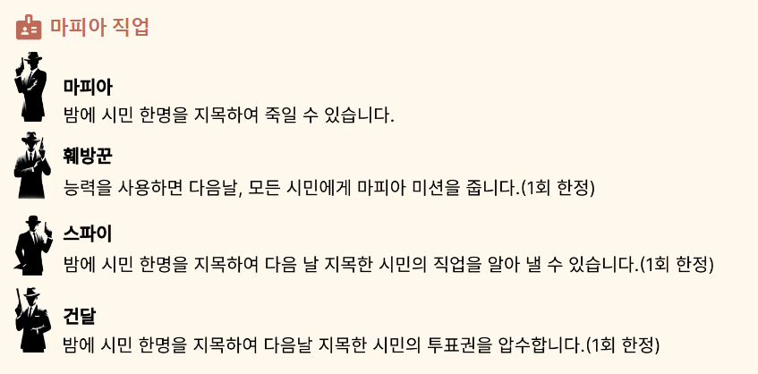
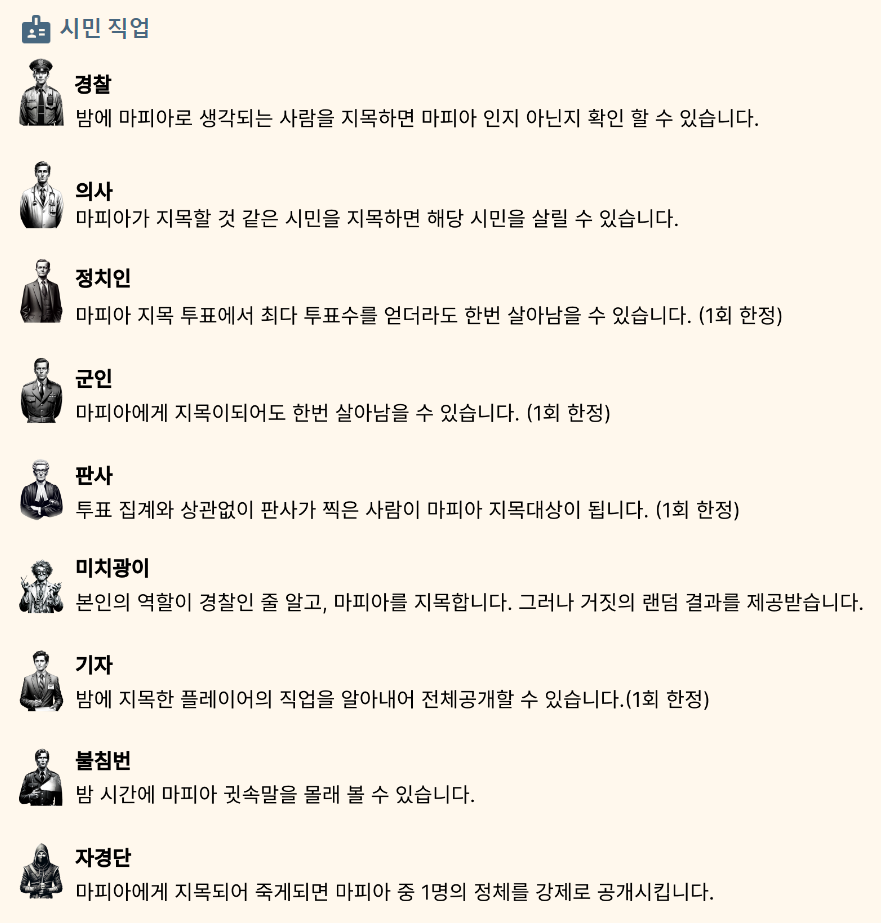

# 🕵️ MSG - Mafia in SNS Game

  

## 📆 프로젝트 기간

2024.12.28 ~ 2024.02.16

### Frontend

### Backend

  

## 📌 배경

요즘 대부분 사람들이 SNS를 즐기는 시대 입니다.  
그러나 최근 지나친 자기과시와 인플루언서 및 기업들의 다량 홍보로 도배되는 SNS의 문화에 적응 하지 못하는 소외계층이 생기고 있습니다.  
SNS에 거부감이 있는 분들은 저희 서비스에서 재밌고 편안한 소통을 즐기길 바라며 MSG를 기획하게 되었습니다.
  

## 📌 개요

MSG는 mafia in sns game의 약자입니다. MSG는 사진을 기반으로 일상을 공유하는 일반적인 sns를 즐길 수 있습니다. 여기에 더불어 리얼 타임으로 진행되는 mafia game에도 참여가 가능 합니다. 게임에 참여하게 되면 매일매일 주어지는 미션을 일상 사진을 업로드 하면서 수행하게 되며, 자연스럽게 서로의 일상을 공유하게 됩니다.

첫번째 장점은 실시간 기반으로 진행되는 mafia 게임 시스템 입니다. 같은 시간에 모여 게임을 진행해야하는 부담감을 줄이고, 여유 시간을 활용하여 미션을 진행 할 수 있다는 것이 큰 장점 입니다.
두번째로 서로의 사진을 보며 소통하고, 함께 게임을 수행하면서 유대감이 생기며 인터넷 상에서의 친구 관계가 형성 됩니다. 일상의 지루함을 해소하며 관계를 형성되는 것은 외로움이 있는 분들에게 많은 도움이 될 수 있습니다.

MSG를 이용하다 보면 자신의 추억들이 사진으로 남게 되며 뿌듯함과, 게임을 이용하며 즐거움 까지 얻을 수 있습니다.
  

## 🖇 아키텍처

  

## 💡 주요 기능

## [SNS]

### 게시물

- 게시물을 작성하고 수정·삭제할 수 있습니다.
- 게시물에 댓글을 작성할 수 있습니다.
- 댓글에 답글을 작성할 수 있습니다.
- 게시물과 댓글/답글에 대한 '좋아요' 상호작용이 가능합니다.
- 부적절한 게시물에 대한 '신고'가 가능합니다.

### 채팅

- 유저 간 실시간 일대일 채팅이 가능합니다.
- 기존 대화 내역을 불러올 수 있습니다.

### 프로필

- 프로필 사진과 닉네임을 설정 및 변경할 수 있습니다.
- 유저의 한 줄 소개를 작성할 수 있습니다.
- 마이 페이지에서 본인의 게임 승률 그래프를 확인할 수 있습니다.

### 팔로우 / 팔로잉

- 유저 간 팔로우 / 팔로잉이 가능합니다.
- 게시물 조회 시 팔로우 목록에 기반하여 우선 순위를 정합니다.

### 알림

- 유저 접속 시 WebSocket을 통해 새로운 알림을 표시합니다.
- 유저 접속 종료 시 Web Push Notification을 통해 새로운 알림을 전달합니다.
    

## [MAFIA GAME]

##### 🔉 MSG 게임은 마피아와 시민 두 진영으로 나뉘어 리얼타임으로 진행됩니다.

##### 🔉 모든 플레이어는 주어진 미션에 맞는 게시물을 업로드하고, 이를 바탕으로 마피아를 유추합니다.

##### 🔉 마피아와 시민은 서로 다른 미션을 받습니다. ex) 시민 미션: 음식 사진 / 마피아 미션: 음료 사진

### | 게임 인원

- 한 게임 당 총 7명의 플레이어가 필요합니다. (마피아 2 + 시민 5)

### | 게임 참여

##### 입장하기

- 랜덤으로 게임을 입장하여 다른 유저들과 익명으로 게임을 즐길 수 있습니다.

##### 방 만들기

- 친구 또는 다른 유저들을 초대하여 게임을 즐길 수 있습니다.
- 생성된 방의 초대 코드를 복사 / 공유할 수 있습니다.

### | 게임 시작

- 오후 1시 이전 7명의 플레이어가 모이면 곧바로 게임이 시작됩니다.
- 오후 1시 이후 7명의 플레이어가 모이면 다음 날 오전 8시 게임이 시작됩니다.

### | 게임 진행

#### ☀ 아침 (08시 ~ 20시)

- 새롭게 배정된 미션을 수행합니다.
- 미션을 수행해야 마피아 지목 투표가 가능합니다.
- 미션을 수행하지 않으면 실종 처리되며, 게임은 패배한 것으로 간주됩니다.

#### 🌙 밤 (20시 ~ 08시)

- 마피아 지목 투표가 마감됩니다. 가장 많은 표를 받은 사람이 처형됩니다.
- 마피아들의 투표가 가능합니다.

##### ✔ 게임 진행 중 마피아 간 대화가 가능합니다.

##### ✔ 게임 종료 시 플레이어 정보를 확인할 수 있습니다.

##### ✔ 게임 종료 시 플레이어 신고가 가능합니다.

### | 직업

#### 마피아 직업

#### 시민 직업

  

## 💡 주요 기술

### Frontend

- Node.js : v20.10.0
- Vue.js : v3.2.13
- Axios
- IDE : Visual Studio Code

### Backend

- Java : v17.0.9
- Spring Boot : v3.2.1
- WebSocket
- STOMP
- IDE : IntelliJ

### Database

- Redis : v5.0.7
- MongoDB : v7.0.5
- MariaDB : v10.3.39
- AWS S3

### Infrastructure

- Docker : v25.0.1
- Docker Compose : v2.24.3
- Docker Distribution : v2.8.3
- NGINX : v1.25.3
- Jenkins : v2.444

### ETC

- Firebase
- OpenAI

  

## 💻 협업 도구

- **GitLab**: 코드 버전 관리와 이슈 추적, Merge Request를 통한 코드리뷰 지원
- **Notion**: 프로젝트 문서화, 회의록 저장, 작업 순서 정리 및 컨벤션 관리
- **JIRA**: 스프린트 계획, 업무 할당 및 진행 상황 추적, 소멸 차트로 프로젝트 진도 확인
- **Figma**: UI 디자인 목업, 와이어프레임 제작, 디자인 작업 공유
- **Mattermost**: 팀 커뮤니케이션, 현재 작업 상황 공유, 기능 수정 공지
- **Draw.io**: 다이어그램 생성, 프로세스 플로우 및 아키텍처 설계
- **ERDCloud**: 데이터베이스 스키마 디자인, ER 다이어그램 작성 및 공유
    

## 👪 팀원 소개

### Frontend

- 현지혜 : 프론트 팀원, Vue.js 담당, 기획 및 디자인, UI/UX 디자인
- 부수환 : 프론트 리더, Vue.js 담당, 상태 관리, UI/UX 디자인

### Backend

- 임규환 : 백엔드 팀원, 기획, Spring Boot 담당, 피드 API, 유저 API
- 이창곤 : 백엔드 팀원, Spring Boot 담당, OpenAI API, AWS S3 API, 게임 API
- 금예인 : 백엔드 팀원, Spring Boot 담당, Scheduler API, WebSocket/STOMP 기반 채팅 서비스, FCM 기반 알림 서비스
- 최호조 : 백엔드 팀원, Spring Boot 담당, 아키텍처 설계, CI/CD, JWT 인증/인가

    

## 📃 프로젝트 산출물

### 1. 기능 명세서

### 2. 와이어 프레임

### 3. ERD

<!-- ### 4. 시퀀스 다이어그램 -->

<!-- ### 5. 클래스 다이어그램 -->

<!-- ## 📃 프로젝트 구조 -->

  

<!-- ## 📃 프로젝트 결과물 -->

## 🌏 서비스 화면

### 1. 전체 사이트

라이트 모드와 다크 모드를 적용하여 밤, 낮이 있는 게임의 특성을 살렸습니다.
반응형 웹을 구현하여 모바일과 pc 브라우저 모두 즐길 수 있게 만들었습니다.

 

### 2. 메인 페이지

    
    

 

- 로그인 화면으로 이동할 수 있습니다.
  피드를 볼 수 있는 화면입니다.
- 좋아요 수를 보여줍니다.
- 내가 팔로우한 사람들의 피드가 무한 스크롤로 구현되어 계속 볼 수 있습니다.

 

### 3. 피드 상세 페이지

    
    

 

- 댓글을 확인하고 작성할 수 있습니다.
- 대댓글 또한 작성 가능합니다.

 

### 4. 게임 페이지

    
    

 

- 랜덤 게임이나 초대코드를 이용한 게임 생성이 가능합니다.
- 게임 설명 페이지로 이동할 수 있습니다.
- 내가 참여 중인 게임 방 목록을 확인할 수 있습니다.

 

### 5. 게임 상세 페이지

    
    

 

- 게임을 진행하는 페이지입니다.
- 화면 왼쪽에 피드, 오른쪽에 채팅창이 있습니다.
- 오른쪽 화면에선 투표, 설명, 능력 사용 화면이 있습니다.

 

### 6. 메시지 페이지

    
    

 

- 개인간 메시지를 주고 받을 수 있습니다.
- 버튼으로 간단히 상대를 추가할 수 있습니다.

 

### 7. 마이 페이지

    
    

 

- 나의 팔로워, 팔로잉 수와 목록을 확인할 수 있습니다.
- 내가 올린 피드들을 볼 수 있습니다.
- 내가 했던 '랜덤'게임의 전적 통계를 확인할 수 있습니다.
