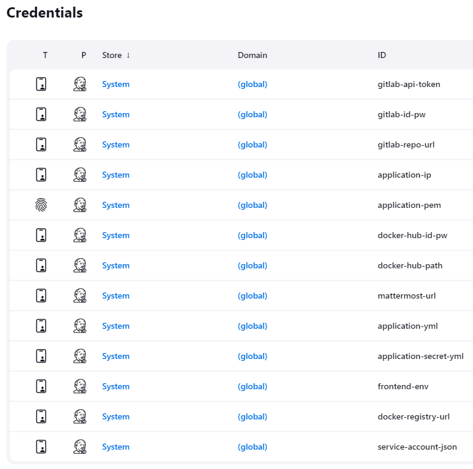

# 📖 포팅 매뉴얼

<br/><br/>

## 🍀 환경 변수

### 1. Frontend

- [frontend/.env](./.env)
- [frontend/src/server.js](./server.js)
- [frontend/public/firebase-messaging-sw.js](./firebase-messaging-sw.js)

### 2. Backend

- [backend/src/main/resources/application.yml](./application.yml)
- [backend/src/main/resources/application-secret.yml](./application-secret.yml)
- [backend/src/main/resources/application-test.yml](./application-test.yml)
- [backend/src/main/resources/service-accound.json](./service-account.json)

<br/><br/>

## 🛠️ 설치 및 실행

본 프로젝트는 Jenkins 서버, Application 서버, MariaDB 서버, MongoDB 서버로 구성되어 있습니다.  
기본적으로 4G 이상의 RAM 환경에 설치하는 것을 권장합니다.

### 1. Redis

1.1. 패키지 업데이트 및 업그레이드

```
sudo apt-get update
sudo apt-get upgrade
sudo apt dist-upgrade
```

1.2. Redis 설치

```
sudo add-apt-repository "deb http://archive.ubuntu.com/ubuntu $(lsb_release -sc) universe"
sudo apt-get install redis-server
```

1.3. Redis 버전 확인

```
redis-server --version
```

1.4. Redis 상태 확인 (기본적으로 Redis는 6379 포트 사용)

```
sudo systemctl status redis.service
```

1.5. Redis 설정 파일

```
sudo nano /etc/redis/redis.conf
```

1.6. 비밀번호 설정 (주석 해제)

```
requirepass {비밀번호}
```

1.7. Redis 접속 및 비밀번호 입력

```
redis-cli
auth {비밀번호}
```

<br/>

### 2. MariaDB

2.1. 패키지 업데이트 및 업그레이드

```
sudo apt-get update
sudo apt-get upgrade
sudo apt dist-upgrade
```

2.2. MariaDB 설치

```
sudo apt install mariadb-server
sudo apt-get install mariadb-client
```

2.3. MariaDB 보안 설정

```
sudo mysql_secure_installation
```

2.4. MariaDB 설치 확인

```
sudo mysql -u root -p
select version();
```

2.5 MariaDB 상태 확인

```
sudo systemctl status mariadb
```

2.6. MariaDB 설정 파일 (허용할 IP 설정)

```
sudo vim /etc/mysql/mariadb.conf.d/50-server.cnf
```

2.7. MariaDB 원격 접속 계정 생성

```
CREATE USER '{사용자명}'@'%' IDENTIFIED BY '{비밀번호}';
GRANT ALL PRIVILEGES ON *.* TO '{사용자명}'@'%';
flush privileges;
```

<br/>

### 3. MongoDB

3.1. 패키지 업데이트 및 업그레이드

```
sudo apt-get update
sudo apt-get upgrade
sudo apt dist-upgrade
```

3.2. MongoDB 설치

```
sudo apt-get install gnupg curl

curl -fsSL https://pgp.mongodb.com/server-7.0.asc | \
   sudo gpg -o /usr/share/keyrings/mongodb-server-7.0.gpg \
   --dearmor

echo "deb [ arch=amd64,arm64 signed-by=/usr/share/keyrings/mongodb-server-7.0.gpg ] https://repo.mongodb.org/apt/ubuntu focal/mongodb-org/7.0 multiverse" | sudo tee /etc/apt/sources.list.d/mongodb-org-7.0.list

sudo apt-get update

sudo apt-get install -y mongodb-org
```

3.3. MongoDB 시작

```
sudo systemctl start mongod
```

3.4. MongoDB 상태 확인

```
sudo systemctl status mongod
```

3.5. 재부팅할 때 MongoDB 시작 설정

```
sudo systemctl enable mongod
```

3.6. MongoDB 접속

```
mongosh "mongodb://{주소}:27017"
use admin
```

3.7. 관리자 계정 추가

```
db.createUser(
  {
    user: "사용자명",
    pwd: passwordPrompt(),
    roles: [
      { role: "userAdminAnyDatabase", db: "admin" },
      { role: "readWriteAnyDatabase", db: "admin" }
    ]
  }
)

// 설정하고 싶은 비밀번호
{비밀번호}
```

3.8. MongoDB 종료

```
db.adminCommand( { shutdown: 1 } )
```

3.9. MongoDB 설정

```
sudo nano /etc/mongod.conf

// bindIp: 허용할 IP 혹은 0.0.0.0으로 변경
// security 주석 해제 후 아래에 "  authorization: enabled" 추가
```

3.10. MongoDB 시작

```
sudo service mongod start

// 시작 시 오류 생길 경우
sudo rm -rf /tmp/mongodb-27017.sock
```

3.11. MongoDB 재접속

```
mongosh --port 27017  --authenticationDatabase     "admin" -u "{사용자명}" -p
```

3.12. 서비스용 DB 설정

```
use msg

db.createUser({
    user: '{사용자명}',
    pwd: '{비밀번호}',
    roles: [{role:'dbOwner', db:'msg'}]
})
```

<br/>

### 4. Jenkins

4.1. Jenkins Dockerfile 작성

```
FROM jenkins/jenkins:jdk17

USER root

RUN apt-get update \
 && apt-get -y install lsb-release \
 && curl -fsSL https://download.docker.com/linux/debian/gpg | gpg --dearmor -o /usr/share/keyrings/docker-archive-keyring.gpg \
 && curl -L "https://github.com/docker/compose/releases/download/v2.5.0/docker-compose-$(uname -s)-$(uname -m)" -o /usr/local/bin/docker-compose \
 && chmod +x /usr/local/bin/docker-compose \
 && echo "deb [arch=amd64 signed-by=/usr/share/keyrings/docker-archive-keyring.gpg] https://download.docker.com/linux/debian $(lsb_release -cs) stable" | tee /etc/apt/sources.list.d/docker.list > /dev/null \
 && apt-get update \
 && apt-get -y install docker-ce docker-ce-cli containerd.io \
 && curl -fsSL https://deb.nodesource.com/setup_20.x | bash - \
 && apt-get install -y nodejs
RUN usermod -aG docker jenkins

USER jenkins
```

4.2. Jenkins docker-compose-jenkins.yml 작성

```
version: '3'
services:
        jenkins:
                restart: always
                container_name: jenkins
                build: .
                image: jenkins:latest
                ports:
                        - "8080:8080"
                volumes:
                        - /home/ubuntu/jenkins-data:/var/jenkins_home
                        - /var/run/docker.sock:/var/run/docker.sock
```

4.3. Credentials 등록



[4.4. 프론트엔드 파이프라인 작성](./frontend_pipeline.yml)

[4.5. 백엔드 파이프라인 작성](./backend_pipeline.yml)

<br/><br/>

### 5. Docker Distribution

5.1. docker-compose-registry.yml 작성

```
version: "3.3"
volumes:
  registry_data: { }
services:
  registry:
    restart: always
    image: registry
    container_name: registry
    volumes:
      - registry_data:/var/lib/registry/docker/registry/v2 # image 저장
    ports:
      - "5000:5000"
```

5.2. 레지스트리가 HTTP를 사용할 경우 다음 파일 수정 (Jenkins EC2)

```
sudo vim /etc/docker/daemon.json
```

5.3. 아래 항목 추가

```
{
    "insecure-registries" : ["{프라이빗 레지스트리 아이피}:5000"]
}
```

5.4. 서비스 재시작

```
sudo systemctl daemon-reload
sudo systemctl restart docker
```

5.5. 레지스트리로부터 이미지를 내려받는 애플리케이션 EC2에도 4.2~4.4 수행

<br/><br/>

### 6. NGINX

6.1. default.conf 작성 (SSL 발급 이전)

```
server {

  listen 80;
  listen [::]:80;
  #listen 443 ssl;
  #listen [::]:443 ssl;
  server_name {도메인 주소 or 공인 아이피};

  root /usr/share/nginx/html;
  #access_log  /var/log/nginx/host.access.log  main;

  location /.well-known/acme-challenge {
    root /var/lib/letsencrypt/;
  }

  location / {
    try_files $uri $uri/ /index.html;
  }

  #error_page  404              /404.html;

  # redirect server error pages to the static page /50x.html

  error_page   500 502 503 504  /50x.html;
  location = /50x.html {
    root   /usr/share/nginx/html;
  }
}
```

6.2. docker-compose-nginx.yml 작성 (SSL 발급 이전)

```
version: '3.1'

services:
  nginx:
    container_name: nginx
    image: nginx:latest
    restart: always
    ports:
      - "80:80"
      - "443:443"
    volumes:
      - /etc/letsencrypt:/etc/letsencrypt
      - /var/lib/letsencrypt:/var/lib/letsencrypt
      - /home/ubuntu/nginx/conf.d:/etc/nginx/conf.d
      - /home/ubuntu/nginx/sites-enabled:/etc/nginx/sites-enabled
        #- /home/ubuntu/nginx/dist:/usr/share/nginx/html
```

6.3. 도커 컨테이너로 NGINX 실행

```
docker-compose -f docker-compose-nginx.yml up -d
```

6.4. SSL 인증서 발급을 위한 certbot 실행 (docker-compose-nginx.yml의 letsencrypt와 볼륨 위치 동일해야 함)

```
docker run -it --rm --name certbot -v "/etc/letsencrypt:/etc/letsencrypt" \
    -v "/var/lib/letsencrypt:/var/lib/letsencrypt" \
    certbot/certbot certonly --webroot -w /var/lib/letsencrypt \
    -d {도메인 주소} --agree-tos
```

6.5. default.conf 작성 (SSL 발급 이후)

```
upstream blue {
  # server i10d109.p.ssafy.io:8080;
  server 172.26.5.89:8080;
}

upstream green {
  server 172.26.5.89:8081;
}

server {
  client_max_body_size 10M;

  include /etc/nginx/conf.d/service-env.inc;

  listen 80;
  listen [::]:80;
  listen 443 ssl;
  listen [::]:443 ssl;
  server_name i10d109.p.ssafy.io;

  root /usr/share/nginx/html;
  #access_log  /var/log/nginx/host.access.log  main;

  if ($scheme = http) {
    return 301 https://$server_name$request_uri;
  }

  location /.well-known/acme-challenge {
    root /var/lib/letsencrypt/;
  }

  location / {
    try_files $uri $uri/ /index.html;
  }

  location /api {
    proxy_pass http://$service_url;

    proxy_set_header Host $host;
    proxy_set_header X-Real-IP $remote_addr;
    proxy_set_header X-Forwarded-For $proxy_add_x_forwarded_for;
    proxy_set_header X-Forwarded-Proto $scheme;
  }

  location /api/ws-stomp {
    proxy_pass http://$service_url;

    proxy_http_version 1.1;
    proxy_set_header Upgrade $http_upgrade;
    proxy_set_header Connection "upgrade";
    proxy_set_header Host $host;
    proxy_set_header X-Real-IP $remote_addr;
    proxy_set_header X-Forwarded-For $proxy_add_x_forwarded_for;
    proxy_set_header X-Forwarded-Proto $scheme;
  }

  ssl_certificate /etc/letsencrypt/live/i10d109.p.ssafy.io/fullchain.pem;
  ssl_certificate_key /etc/letsencrypt/live/i10d109.p.ssafy.io/privkey.pem;

  #error_page  404              /404.html;

  # redirect server error pages to the static page /50x.html
  #
  error_page   500 502 503 504  /50x.html;
  location = /50x.html {
    root   /usr/share/nginx/html;
  }

  # proxy the PHP scripts to Apache listening on 127.0.0.1:80
  #
  #location ~ \.php$ {
  #    proxy_pass   http://127.0.0.1;
  #}

  # pass the PHP scripts to FastCGI server listening on 127.0.0.1:9000
  #
  #location ~ \.php$ {
  #    root           html;
  #    fastcgi_pass   127.0.0.1:9000;
  #    fastcgi_index  index.php;
  #    fastcgi_param  SCRIPT_FILENAME  /scripts$fastcgi_script_name;
  #    include        fastcgi_params;
  #}

  # deny access to .htaccess files, if Apache's document root
  # concurs with nginx's one
  #
  #location ~ /\.ht {
  #    deny  all;
  #}
}
```

6.6. docker-compose-nginx.yml 작성 (SSL 발급 이후)

```
version: '3.1'

services:
  nginx:
    container_name: nginx
    image: nginx:latest
    restart: always
    ports:
      - "80:80"
      - "443:443"
    volumes:
      - /etc/letsencrypt:/etc/letsencrypt
      - /var/lib/letsencrypt:/var/lib/letsencrypt
      - /home/ubuntu/nginx/conf.d:/etc/nginx/conf.d
      - /home/ubuntu/nginx/sites-enabled:/etc/nginx/sites-enabled
      - /home/ubuntu/nginx/dist:/usr/share/nginx/html
```

6.7. deploy.sh 작성 (default.conf에서 $service_url을 blue <-> green으로 바꿔주는 역할)

```
#!/bin/bash
targetUpstream=$1
echo "set \$service_url $targetUpstream;" > /etc/nginx/conf.d/service-env.inc
```

6.8. service-env.inc 작성

```
set $service_url blue;
```

6.9. sites.conf 작성

```
include /etc/nginx/sites-enabled/*;
```

6.10. NGINX 컨테이너 종료

```
docker-compose -f docker-compose-nginx.yml down
```

6.11. 도커 컨테이너로 NGINX 실행

```
docker-compose -f docker-compose-nginx.yml up -d
```

<br/><br/>

### 7. Blue Green Server

7.1. docker-compose-blue.yml 작성

```
version: '3.8'

services:
  blue:
    restart: always
    image: {프라이빗 레지스트리 아이피}:5000/mafia-in-sns-game:latest
    container_name: blue
    ports:
      - "8080:8080"
    environment:
      - PROFILES=blue
      - ENV=blue
      - JASYPT_PASSWORD={비밀번호}
    extra_hosts:
      - host.docker.internal:host-gateway
```

7.2. docker-compose-green.yml 작성

```
version: '3.8'

services:
  green:
    restart: always
    image: {프라이빗 레지스트리 아이피}:5000/mafia-in-sns-game:latest
    container_name: green
    ports:
      - "8081:8081"
    environment:
      - PROFILES=green
      - ENV=green
      - JASYPT_PASSWORD={비밀번호}
    extra_hosts:
      - host.docker.internal:host-gateway
```

7.3. 백엔드 프로젝트 디렉토리에 있는 Dockerfile 작성

```
FROM amazoncorretto:17-alpine-jdk
ARG JAR_FILE=build/libs/backend-0.0.1-SNAPSHOT.jar
ARG PROFILES
ARG ENV
ARG JASYPT_PASSWORD
COPY ${JAR_FILE} backend.jar
ENTRYPOINT ["java", "-Dspring.profiles.active=${PROFILES}", "-Dserver.env=${ENV}", "-Djasypt.encryptor.password=${JASYPT_PASSWORD}", "-jar", "/backend.jar"]
```

7.4. Application 서버 Jenkins Webhook으로 실행

```
docker-compose -f docker-compose-blue(green).yml up -d
```
